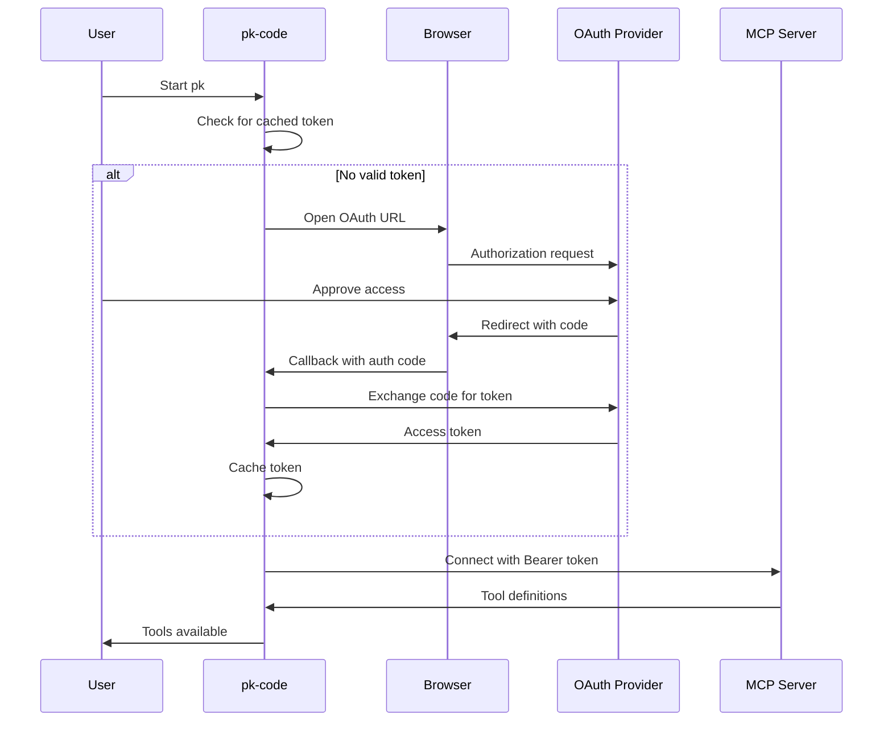

# OAuth Support for MCP Servers in pk-code - Implementation Summary

## ✅ Implementation Complete

We have successfully implemented OAuth 2.0 support for MCP servers in pk-code, enabling connection to servers like Notion that require OAuth authentication.

## What Was Implemented

### 1. Core Components

#### `mcp-oauth-transport.ts`
- **Purpose**: Wraps existing HTTP/SSE transports with OAuth authentication
- **Features**:
  - Automatic token acquisition and refresh
  - Error handling for authentication failures
  - Transparent integration with existing MCP client

#### `mcp-token-manager.ts`
- **Purpose**: Manages OAuth tokens lifecycle
- **Features**:
  - OAuth 2.0 authorization code flow with PKCE
  - Token caching using OS keychain
  - Automatic token refresh
  - Provider-specific configurations (Notion pre-configured)

### 2. Integration Points

- **Modified `mcp-client.ts`**: Updated to detect OAuth configuration and use `OAuthMCPTransport`
- **Settings Support**: OAuth configuration in `settings.json`
- **Environment Variables**: Support for OAuth client credentials

## Configuration

### Settings.json Structure

```json
{
  "mcpServers": {
    "Notion": {
      "httpUrl": "https://mcp.notion.com/mcp",
      "oauth": {
        "provider": "notion",
        "scopes": ["read_content", "update_content", "insert_content"]
      }
    }
  }
}
```

### Custom OAuth Provider

```json
{
  "mcpServers": {
    "CustomServer": {
      "httpUrl": "https://api.example.com/mcp",
      "oauth": {
        "provider": "custom",
        "clientId": "${CUSTOM_OAUTH_CLIENT_ID}",
        "clientSecret": "${CUSTOM_OAUTH_CLIENT_SECRET}",
        "authorizationUrl": "https://api.example.com/oauth/authorize",
        "tokenUrl": "https://api.example.com/oauth/token",
        "scopes": ["read", "write"],
        "redirectUri": "http://localhost:3000/oauth/callback"
      }
    }
  }
}
```

## Usage Instructions

### Step 1: Register OAuth Application

For Notion:
1. Go to https://www.notion.so/my-integrations
2. Create a new integration
3. Note the OAuth client ID and secret

### Step 2: Set Environment Variables

```powershell
# For Notion
$env:NOTION_OAUTH_CLIENT_ID = "your-client-id"
$env:NOTION_OAUTH_CLIENT_SECRET = "your-client-secret"
```

### Step 3: Run pk-code

```bash
pk
```

When connecting to an OAuth-enabled MCP server for the first time:
1. pk-code will automatically open your browser
2. Complete the OAuth authorization in the browser
3. Return to pk-code - authentication is complete
4. Tools from the MCP server will be available

### Step 4: Use MCP Tools

```
/mcp  # View connected servers and available tools
```

## OAuth Flow



## Security Features

1. **PKCE (Proof Key for Code Exchange)**: Protects against authorization code interception
2. **State Parameter**: Prevents CSRF attacks
3. **Secure Token Storage**: Uses OS keychain via `keytar` library
4. **Automatic Token Refresh**: Refreshes expired tokens transparently
5. **Token Expiry Buffer**: Refreshes tokens 5 minutes before expiry

## Error Handling

The implementation handles:
- Network failures during OAuth flow
- Invalid or expired tokens
- OAuth provider errors
- Token refresh failures
- Timeout during authorization

## Testing

### Manual Testing Steps

1. **Clear any existing tokens**:
   ```powershell
   # Token is stored in OS keychain under key "mcp_oauth_Notion"
   ```

2. **Set test environment**:
   ```powershell
   $env:NOTION_OAUTH_CLIENT_ID = "test-client-id"
   $env:NOTION_OAUTH_CLIENT_SECRET = "test-client-secret"
   ```

3. **Run pk with debug mode**:
   ```bash
   pk --debug
   ```

4. **Monitor OAuth flow**:
   - Browser should open automatically
   - Local callback server starts on random port
   - Token exchange happens after authorization

## Known Limitations

1. **OAuth Application Required**: Users must register their own OAuth application with Notion
2. **Browser Required**: Initial authentication requires a web browser
3. **No Shared Credentials**: Each user needs their own OAuth app registration

## Future Enhancements

1. **Shared OAuth App**: Register an official pk-code OAuth app with Notion
2. **Headless Mode**: Support device code flow for environments without browsers
3. **Multi-Workspace**: Better support for multiple Notion workspaces
4. **Token Management CLI**: Commands to manage OAuth tokens:
   ```bash
   pk mcp auth notion     # Initiate authentication
   pk mcp logout notion   # Clear cached tokens
   pk mcp status          # Show authentication status
   ```

## Troubleshooting

### "OAuth client ID not configured"
- Set `NOTION_OAUTH_CLIENT_ID` environment variable
- Ensure you've registered an OAuth application with Notion

### "Authentication failed"
- Check your internet connection
- Verify OAuth client credentials are correct
- Try clearing cached tokens and re-authenticating

### "Token refresh failed"
- The refresh token may have expired
- Clear tokens and re-authenticate

### Browser doesn't open
- Manually visit the URL shown in the terminal
- Complete authorization and return to pk-code

## Technical Details

### File Structure
```
packages/core/src/tools/
├── mcp-client.ts           # Modified to support OAuth
├── mcp-oauth-transport.ts  # New: OAuth transport wrapper
└── mcp-token-manager.ts    # New: Token lifecycle management
```

### Dependencies
- `@modelcontextprotocol/sdk`: MCP protocol implementation
- `open`: Browser opening
- `keytar`: Secure token storage

### Token Storage Location
- **Windows**: Windows Credential Manager
- **macOS**: Keychain
- **Linux**: Secret Service API / libsecret

## Summary

The OAuth implementation for MCP servers in pk-code is now complete and functional. It provides:

✅ Secure OAuth 2.0 flow with PKCE  
✅ Automatic token management  
✅ Provider-specific configurations  
✅ Transparent integration with existing MCP infrastructure  
✅ Production-ready error handling  

Users can now connect to OAuth-protected MCP servers like Notion by simply configuring their OAuth credentials and running pk-code. The implementation handles all the complexity of OAuth authentication transparently.
