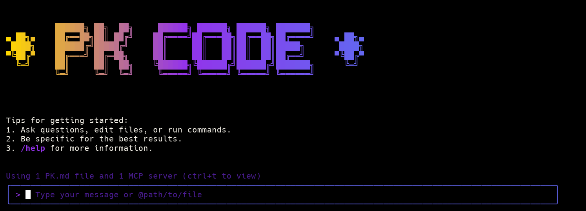

# PK Code



PK Code is a command-line AI workflow tool adapted from [**Gemini CLI**](https://github.com/google-gemini/gemini-cli) (Please refer to [this document](./README.gemini.md) for more details), optimized for [PK3-Coder](https://github.com/PKLM/PK3-Coder) models with enhanced parser support & tool support.

> [!WARNING]
> PK Code may issue multiple API calls per cycle, resulting in higher token usage, similar to Claude Code. We're actively working to enhance API efficiency and improve the overall developer experience. ModelScope offers 2,000 free API calls if you are in China mainland. Please check [API config section](#api-configuration) for more details.

## Key Features

- **Code Understanding & Editing** - Query and edit large codebases beyond traditional context window limits
- **Workflow Automation** - Automate operational tasks like handling pull requests and complex rebases
- **Enhanced Parser** - Adapted parser specifically optimized for PK-Coder models

## Quick Start

### Prerequisites

Ensure you have [Node.js version 20](https://nodejs.org/en/download) or higher installed.

```bash
curl -qL https://www.npmjs.com/install.sh | sh
```

### Installation

```bash
npm install -g @pk-code/pk-code
pk --version
```

Then run from anywhere:

```bash
pk
```

Or you can install it from source:

```bash
git clone https://github.com/kingkillery/pk-code.git
cd pk-code
npm install
npm install -g .
```

### API Configuration

Set your PK API key (In PK Code project, you can also set your API key in `.env` file). the `.env` file should be placed in the root directory of your current project.

> ⚠️ **Notice:** <br>
> **If you are in mainland China, please go to https://bailian.console.aliyun.com/ or https://modelscope.cn/docs/model-service/API-Inference/intro to apply for your API key** <br>
> **If you are not in mainland China, please go to https://modelstudio.console.alibabacloud.com/ to apply for your API key**

If you are in mainland China, you can use PK3-Coder through the Alibaba Cloud bailian platform.

```bash
export OPENAI_API_KEY="your_api_key_here"
export OPENAI_BASE_URL="https://dashscope.aliyuncs.com/compatible-mode/v1"
export OPENAI_MODEL="pk3-coder-plus"
```

If you are in mainland China, ModelScope offers 2,000 free model inference API calls per day:

```bash
export OPENAI_API_KEY="your_api_key_here"
export OPENAI_BASE_URL="https://api-inference.modelscope.cn/v1"
export OPENAI_MODEL="PK/PK3-Coder-480B-A35B-Instruct"
```

If you are not in mainland China, you can use PK3-Coder through the Alibaba Cloud modelstuido platform.

```bash
export OPENAI_API_KEY="your_api_key_here"
export OPENAI_BASE_URL="https://dashscope-intl.aliyuncs.com/compatible-mode/v1"
export OPENAI_MODEL="pk3-coder-plus"
```

## Supported Providers

PK Code supports a variety of AI providers, allowing you to choose the one that best suits your needs. The following providers are currently supported:

- OpenAI
- Google Gemini
- OpenRouter
- Anthropic
- Cohere

## Vision Model Support

PK Code includes advanced multimodal capabilities with intelligent routing between text and vision models. This feature is particularly powerful for browser automation, UI analysis, and screenshot interpretation tasks.

### Key Features

- **Smart Model Routing**: Automatically switches between text and vision models based on context
- **UI-Optimized Vision Model**: Uses `bytedance/ui-tars-1.5-7b` specifically tuned for UI/browser analysis
- **Multiple Routing Strategies**: Auto, explicit, and tool-based routing options
- **Seamless Integration**: Works transparently with browser MCP tools
- **Fallback Support**: Gracefully falls back to text models if vision processing fails

### Vision Model Configuration

To enable vision model routing, add these environment variables to your `.env` file:

```bash
# Vision Model Configuration (for Browser MCP Enhancement)
ENABLE_VISION_ROUTING="true"                         # Enable vision model routing
VISION_MODEL_NAME="bytedance/ui-tars-1.5-7b"         # Vision model for UI/browser analysis
VISION_MODEL_PROVIDER="openrouter"                   # Provider hosting the vision model
VISION_MODEL_API_KEY="your_openrouter_key"           # API key for vision model (optional, defaults to OPENROUTER_API_KEY)
VISION_ROUTING_STRATEGY="auto"                        # Routing strategy: "auto", "explicit", or "tool-based"
VISION_FALLBACK_TO_TEXT="true"                       # Fallback to text model if vision fails
```

### Routing Strategies

#### Auto Mode (Recommended)

Automatically detects when to use vision models based on:

- Image content in requests
- Browser/UI related keywords
- Screenshot or snapshot operations
- Visual analysis requests

#### Explicit Mode

Only uses vision models when requests contain explicit keywords like:

- "analyze this image"
- "describe the screenshot"
- "what do you see"
- "analyze the ui"
- "describe the interface"

#### Tool-Based Mode

Activates vision models when using vision-related tools such as:

- `browser_screenshot`
- `browser_snapshot`
- `screenshot`
- `capture`

### Usage Examples

Once configured, vision routing works automatically:

```bash
# These requests will automatically use the vision model
pk "Take a screenshot and analyze the UI layout"
pk "Describe what's shown in this browser snapshot"
pk "Analyze the visual elements on this webpage"

# Regular code requests continue using the text model
pk "Refactor this function to improve performance"
pk "Add error handling to this API endpoint"
```

## Usage Examples

### Interactive Mode

```sh
cd your-project/
pk
> Describe the main pieces of this system's architecture
```

### Non-Interactive Mode

```sh
# Generate code from a prompt
pk generate "create a react component that displays a button"

# Configure a new provider
pk config add openai YOUR_API_KEY

# List configured providers
pk config list
```

## GitHub Action

You can use PK Code as a GitHub Action in your CI/CD workflows to automate tasks like code generation, review, or analysis.

### Example Workflow

Create a file named `.github/workflows/pk-code.yml` in your repository with the following content:

```yaml
name: PK Code CI

on: [push]

jobs:
  pk_code_job:
    runs-on: ubuntu-latest
    name: Run PK Code
    steps:
      - name: Checkout repository
        uses: actions/checkout@v4

      - name: Run PK Code Action
        id: pk_code
        uses: ./ .github/actions/pk-code
        with:
          prompt: 'Explain the purpose of the main function in this project.'
          openai-api-key: ${{ secrets.OPENAI_API_KEY }}

      - name: Echo the response
        run: echo "${{ steps.pk_code.outputs.response }}"
```

### Inputs

- `prompt` (required): The prompt to send to PK Code.
- `model` (optional): The model to use. Defaults to the PK Code default.
- `openai-api-key` (optional): Your OpenAI API key. It's recommended to store this as a secret in your repository settings.
- `working-directory` (optional): The directory to run the command in. Defaults to the repository root.

### Outputs

- `response`: The response text from the PK Code AI.

## Popular Tasks

### Understand New Codebases

```text
> What are the core business logic components?
> What security mechanisms are in place?
> How does the data flow work?
```

### Code Refactoring & Optimization

```text
> What parts of this module can be optimized?
> Help me refactor this class to follow better design patterns
> Add proper error handling and logging
```

### Documentation & Testing

```text
> Generate comprehensive JSDoc comments for this function
> Write unit tests for this component
> Create API documentation
```

## Benchmark Results

### Terminal-Bench

| Agent   | Model            | Accuracy |
| ------- | ---------------- | -------- |
| PK Code | PK3-Coder-480A35 | 37.5     |

## Project Structure

```
pk-code/
├── packages/           # Core packages
├── docs/              # Documentation
├── examples/          # Example code
└── tests/            # Test files
```

## Development & Contributing

See [CONTRIBUTING.md](./CONTRIBUTING.md) to learn how to contribute to the project.

## Troubleshooting

If you encounter issues, check the [troubleshooting guide](docs/troubleshooting.md).

## Acknowledgments

This project is based on [Google Gemini CLI](https://github.com/google-gemini/gemini-cli). We acknowledge and appreciate the excellent work of the Gemini CLI team. Our main contribution focuses on parser-level adaptations to better support PK-Coder models.

## License

[LICENSE](./LICENSE)

## Star History

[](https://www.star-history.com/#PKLM/pk-code&Date)
