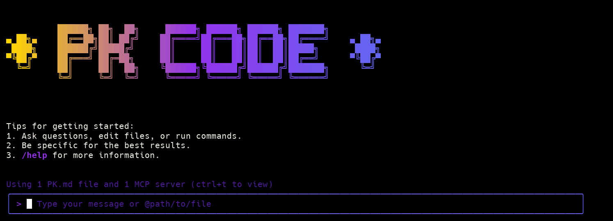

# PK Code CLI



PK Code is a powerful AI-driven command-line interface that transforms how developers interact with code. Built as a modern terminal application, it combines the power of large language models with intuitive developer workflows to streamline coding, debugging, and project management tasks.

## ✨ Key Features

- **🧠 Intelligent Code Analysis** - Understand complex codebases instantly with AI-powered insights
- **⚡ Interactive Terminal Interface** - Beautiful, responsive CLI built with React and Ink
- **🔗 Multi-Provider Support** - Works with OpenAI, Anthropic, Google Gemini, Qwen, and OpenAI-compatible endpoints
- **🎯 Context-Aware Assistance** - Maintains project context across conversations with advanced context window management
- **🛠️ Workflow Automation** - Automate repetitive development tasks with multi-step instruction processing
- **🔍 Vision Model Integration** - Advanced UI analysis and screenshot interpretation
- **📦 Monorepo Architecture** - Scalable codebase with modular packages
- **📋 Advanced Task Management** - Comprehensive todo tool with priorities, dependencies, and project tracking
- **🧠 Memory Management** - Separate project-level and global memory with intelligent search and organization
- **🔧 Enhanced Function Calling** - Multi-step program synthesis and agentic workflow support
- **🌐 OpenAI-Compatible APIs** - Support for custom endpoints, Azure OpenAI, Together AI, and more

## 🚀 Quick Start

### Prerequisites

- [Node.js 20+](https://nodejs.org/en/download)
- Your preferred AI provider API key

## Installation

## Verify installation

- Check the installed version on npm:
  - npm view pk-code-cli version
- Confirm the CLI shows the new flag and runs with a file prompt (safe no-op):
  - echo "Test" > prompt.txt (or use PowerShell Set-Content)
  - pk --prompt-file prompt.txt --list-extensions

#### From npm (Recommended)

```bash
npm install -g pk-code-cli
pk --version
```

#### From Source

```bash
git clone https://github.com/kingkillery/pk-code.git
cd pk-code
npm install
npm run build
npm install -g .
```

### Configuration

Create a `.env` file in your project root or set environment variables:

#### OpenAI

```bash
export OPENAI_API_KEY="your_openai_key"
export OPENAI_MODEL="gpt-4"
```

#### Anthropic Claude

```bash
export ANTHROPIC_API_KEY="your_anthropic_key"
export ANTHROPIC_MODEL="claude-3-5-sonnet-20241022"
```

#### Google Gemini

```bash
export GOOGLE_API_KEY="your_google_key"
export GOOGLE_MODEL="gemini-1.5-pro"
```

#### Qwen Models

```bash
export QWEN_API_KEY="your_qwen_key"
export QWEN_MODEL="qwen2-72b-instruct"
```

#### OpenAI-Compatible Endpoints

```bash
# Azure OpenAI
export AZURE_OPENAI_API_KEY="your_azure_key"
export AZURE_OPENAI_ENDPOINT="https://your-resource.openai.azure.com"
export AZURE_OPENAI_MODEL="gpt-4"

# Together AI
export TOGETHER_API_KEY="your_together_key"
export TOGETHER_MODEL="codellama/CodeLlama-34b-Instruct-hf"

# Custom OpenAI-compatible endpoint
export CUSTOM_OPENAI_API_KEY="your_api_key"
export CUSTOM_OPENAI_BASE_URL="https://your-endpoint.com/v1"
export CUSTOM_OPENAI_MODEL="your-model-name"
```

#### ModelScope (for Mainland China)

```bash
export MODELSCOPE_API_KEY="your_modelscope_key"
export MODELSCOPE_MODEL="qwen/Qwen2-72B-Instruct"
```

## 🎯 Usage

### Interactive Mode

Launch PK Code in interactive mode for conversational coding assistance:

```bash
cd your-project/
pk
```

Example interactions:

```
> Explain the architecture of this codebase
> Help me debug this React component
> Generate unit tests for the auth service
> Refactor this function to use TypeScript
```

### Direct Commands

Execute specific tasks without entering interactive mode:

```bash
# Code generation
pk generate "Create a REST API endpoint for user authentication"

# Code analysis (use interactive prompt or provider-specific commands)
pk "What are the performance bottlenecks in this code?"

# Documentation (ask directly)
pk "Generate JSDoc comments for all functions in src/utils"
```

## 🔌 Supported AI Providers

| Provider              | Models                               | Features                             |
| --------------------- | ------------------------------------ | ------------------------------------ |
| **OpenAI**            | GPT-4, GPT-4-Turbo, GPT-3.5          | Chat, Code, Vision, Function Calling |
| **Anthropic**         | Claude 3.5 Sonnet, Claude 3          | Advanced reasoning, Code             |
| **Google**            | Gemini 1.5 Pro, Gemini 1.0 Pro       | Multimodal, Long context (up to 1M)  |
| **Qwen**              | Qwen2-72B, Qwen2-Coder               | Code generation, Large context       |
| **OpenAI-Compatible** | Azure OpenAI, Together AI, Replicate | Custom endpoints, Multiple models    |
| **OpenRouter**        | Multiple models                      | Model variety, Cost optimization     |
| **Cohere**            | Command R+, Command                  | Multilingual, RAG                    |

## 🎨 Vision & Multimodal Support

PK Code features advanced vision capabilities for UI analysis, screenshot interpretation, and visual debugging.

### Features

- **🔄 Smart Model Routing** - Automatically chooses between text and vision models
- **🖥️ UI Analysis** - Specialized models for interface understanding
- **📸 Screenshot Processing** - Analyze application screenshots and mockups
- **🔧 Browser Integration** - Works seamlessly with browser automation tools

### Configuration

```bash
# Enable vision capabilities
ENABLE_VISION_ROUTING=true
VISION_MODEL_NAME="gpt-4-vision-preview"
VISION_MODEL_PROVIDER="openai"
VISION_ROUTING_STRATEGY="auto"
```

### Example Usage

```bash
# Analyze a screenshot
pk "What UI improvements can you suggest for this dashboard?"

# Debug visual issues
pk "Why is the layout broken on mobile devices?"

# Generate code from mockups
pk "Convert this design mockup into React components"
```

## 🌐 Browser Automation

PK Code supports browser automation through two methods: the cloud-based Browser Use API and a local browser-use MCP server, providing flexibility for different use cases.

### Features

- **Dual Mode Support**: Choose between cloud API or local browser automation
- **Cloud-based Browser Control**: Execute browser automation tasks through the Browser Use API
- **Local Browser Agent**: Run browser automation locally via MCP integration
- **UI Interaction**: Click, type, and read content from web pages
- **Structured Output**: Get results in specified JSON formats
- **Task Monitoring**: Real-time streaming of task execution steps
- **Task Control**: Pause, resume, or stop running tasks

### Configuration

#### Cloud API Mode (Default)

To use cloud-based browser automation, set your Browser Use API key:

```bash
export BROWSER_USE_API_KEY="your-api-key-here"
```

#### Local Browser Mode

For local browser automation without cloud dependencies:

```bash
# Prevent cloud API conflicts when using local browser
export PK_PREFER_LOCAL_BROWSER=1

# Start the local browser agent
pk
> /browser-use local
```

### Usage Examples

#### Cloud API Usage

```bash
> pk
> Use browser_use to go to google.com and search for AI news
```

#### Local Browser Agent Usage

```bash
# Set environment variable to prefer local browser
export PK_PREFER_LOCAL_BROWSER=1

# Start PK Code
> pk
> /browser-use local
Local browser agent is ready!
> Navigate to https://github.com/kingkillery/pk-code and tell me how many open issues there are.
```

### Environment Variables

| Variable                  | Description                                                | Required       |
| ------------------------- | ---------------------------------------------------------- | -------------- |
| `BROWSER_USE_API_KEY`     | API key for cloud Browser Use service                      | For cloud mode |
| `PK_PREFER_LOCAL_BROWSER` | Set to `1` to disable cloud API and use local browser only | For local mode |

### Troubleshooting

- **Authentication errors**: If you see 401 errors when using local browser, ensure `PK_PREFER_LOCAL_BROWSER=1` is set
- **Port conflicts**: The local browser agent uses port 3001 by default
- **Agent management**: Use `pk agent stop browser` to stop the local browser agent

## 🧠 Enhanced Command Parser & Multi-Step Instructions

PK Code now supports advanced command parsing for complex, multi-step instructions and agentic workflows.

### Multi-Step Instructions

Execute complex workflows with natural language:

```bash
pk "First analyze the codebase structure, then identify performance bottlenecks, and finally generate optimization recommendations"
```

The system automatically:

- Parses multi-step instructions using natural language processing
- Determines workflow type (sequential, parallel, conditional)
- Assesses task complexity and resource requirements
- Routes to appropriate specialized agents
- Manages dependencies and execution order

### Supported Patterns

- **Sequential workflows**: "First do X, then do Y, finally do Z"
- **Parallel execution**: "Do X, Y, and Z simultaneously"
- **Conditional logic**: "If condition A, then do X, else do Y"
- **Iterative processes**: "Repeat X until condition Y is met"

### Agent-Specific Commands

Direct commands to specialized agents:

```bash
pk "/architect analyze this microservices architecture"
/developer "implement authentication middleware"
/tester "create comprehensive test suite"
```

## 🔧 Advanced Function Calling & Agentic Workflows

### Multi-Step Program Synthesis

PK Code can synthesize complete programs through orchestrated function calling:

```bash
pk "Create a full-stack web application with user authentication, database integration, and API endpoints"
```

The system automatically:

- Analyzes program requirements
- Designs system architecture
- Generates code components
- Implements core functionality
- Adds features and enhancements
- Performs integration testing
- Generates documentation

### Function Call Chains

Complex operations are broken down into dependency-aware function call chains:

```bash
pk "Build a CI/CD pipeline with automated testing, deployment, and monitoring"
```

Features:

- **Dependency Management**: Automatic resolution of task dependencies
- **Error Handling**: Configurable retry logic and fallback strategies
- **Progress Tracking**: Real-time monitoring of multi-step execution
- **Resource Management**: Intelligent allocation based on task complexity

## 📏 Context Window Management (256K - 1M Tokens)

### Advanced Context Management

PK Code supports large context windows with intelligent compression and extension:

```bash
# Automatic context window scaling based on operation complexity
pk "Analyze this entire codebase and provide architectural recommendations"
```

### Features

- **Dynamic Scaling**: Automatically extends context window for complex operations
- **Intelligent Compression**: Selective retention of high-priority content
- **Memory Optimization**: Multiple compression strategies (truncate, selective, hierarchical)
- **Token Estimation**: Accurate token counting with buffer management

### Model-Specific Support

| Model Provider | Context Window | Extension Support    |
| -------------- | -------------- | -------------------- |
| Qwen 3-Coder   | 256K - 1M      | ✅ Full support      |
| GPT-4 Turbo    | 128K           | ⚠️ Limited extension |
| Gemini 1.5 Pro | 1M+            | ✅ Full support      |
| Claude 3.5     | 200K           | ✅ Extension support |

## 🧠 Memory Management System

### Project vs Global Memory

PK Code maintains separate memory stores for different scopes:

```bash
# Add to project memory
pk memory add context "This project uses React with TypeScript"

# Add to global memory
pk memory add context "I prefer functional programming patterns" --global

# Search across all memory
pk memory search "authentication patterns"

# Get recent insights
pk memory recent 24
```

### Memory Commands

```bash
# Add memory entry
pk memory add <type> <content> [--global] [--tags tag1,tag2]

# Search memory
pk memory search <query> [--tags tag1,tag2] [--type context]

# List memory entries
pk memory list [type] [--project|--global]

# Get recent memory
pk memory recent <hours>

# Delete memory entries
pk memory delete <id1> <id2> [--project|--global]

# Clean expired entries
pk memory clean

# Export memory to file
pk memory export <file> [--query "search"] [--global]

# Import memory from file
pk memory import <file> [--merge]

# Show memory statistics
pk memory stats [--global]
```

### Memory Types

- **context**: Project or global context information
- **insight**: Learned insights and best practices
- **decision**: Important decisions and their rationale
- **task**: Task-related information and progress
- **conversation**: Important conversation threads
- **code-snippet**: Useful code patterns and examples

## 📋 Advanced Todo Management

### Comprehensive Task Management

PK Code includes a powerful todo tool for project and personal task management:

```bash
# Create a new todo
pk
> Use todo tool to create task "Implement user authentication" with high priority and due date 2024-02-01

# Query todos by status
pk
> Use todo tool to query todos with status "pending" and priority "high"

# Add subtasks
pk
> Use todo tool to add subtask "Setup JWT tokens" to parent task "Implement user authentication"

# Update todo status
pk
> Use todo tool to update todo with id "todo_123" and set status "completed"
```

### Todo Features

- **Priority Management**: low, medium, high, critical priorities
- **Due Date Tracking**: Set and track due dates with overdue detection
- **Dependency Management**: Link tasks with prerequisites
- **Subtasks**: Break down complex tasks into manageable subtasks
- **Categories & Tags**: Organize tasks by category and flexible tagging
- **Time Tracking**: Estimate and track actual hours spent
- **Assignee Management**: Assign tasks to team members
- **Status Tracking**: pending, in-progress, completed, cancelled, blocked

### Todo Commands

```bash
# Create todo
pk
> Use todo tool with action "create" and data including title "Implement API" and priority "high"

# Update todo
pk
> Use todo tool with action "update" and data including id "todo_123" and status "completed"

# Query todos
pk
> Use todo tool with action "query" and data including status ["pending"] and priority ["high"]

# Add subtask
pk
> Use todo tool with action "addSubtask" and data including parentId "todo_123" and title "Database setup"

# Get statistics
pk
> Use todo tool with action "getStats"
```

## 🌐 OpenAI-Compatible API Integration

### Supported Providers

PK Code supports various OpenAI-compatible endpoints:

#### Azure OpenAI

```bash
export AZURE_OPENAI_API_KEY="your-key"
export AZURE_OPENAI_ENDPOINT="https://your-resource.openai.azure.com"
export AZURE_OPENAI_DEPLOYMENT="gpt-4"
export AZURE_OPENAI_API_VERSION="2023-12-01-preview"
```

#### Together AI

```bash
export TOGETHER_API_KEY="your-key"
export TOGETHER_BASE_URL="https://api.together.xyz/v1"
export TOGETHER_MODEL="codellama/CodeLlama-34b-Instruct-hf"
```

#### Replicate

```bash
export REPLICATE_API_KEY="your-key"
export REPLICATE_BASE_URL="https://openai-proxy.replicate.com/v1"
export REPLICATE_MODEL="your-model-name"
```

### Custom Endpoints

Support for any OpenAI-compatible API:

```bash
export CUSTOM_OPENAI_API_KEY="your-key"
export CUSTOM_OPENAI_BASE_URL="https://your-custom-endpoint.com/v1"
export CUSTOM_OPENAI_MODEL="your-model"
```

### Features

- **Full Compatibility**: Supports all OpenAI API features including function calling
- **Streaming Support**: Real-time response streaming
- **Custom Headers**: Support for custom authentication headers
- **Retry Logic**: Configurable retry policies and timeouts
- **Model Auto-Detection**: Automatic model capability detection

## 🏗️ Advanced Workflow Automation

### GitHub Integration

PK Code supports advanced GitHub workflow automation:

```bash
# PR Review and Analysis
pk "Review this pull request and suggest improvements"

# Issue Triage
pk "Analyze these GitHub issues and prioritize them"

# Automated Submissions
pk "Create a pull request for the authentication feature"
```

### Complex Code Refactoring

Handle multi-file refactoring operations:

```bash
pk "Refactor this entire authentication module to use the new design patterns"
```

Features:

- **Multi-file Analysis**: Analyze dependencies across files
- **Batch Operations**: Apply changes across multiple files
- **Safety Checks**: Validate changes before applying
- **Rollback Support**: Easy reversion of complex changes

### Workflow Scripting

Create reusable workflow scripts:

```bash
# Define a workflow script for code review that includes linting, testing, and documentation checks
```

## 🔌 MCP Server Integration

PK Code supports Model Context Protocol (MCP) servers to extend functionality with custom tools and external integrations. MCP servers can provide additional capabilities like database access, API integrations, or specialized workflows.

### Configuration

MCP servers are configured in the `.pk/settings.json` file. This file can be located either:

- Globally: `~/.pk/settings.json`
- Per-project: `.pk/settings.json` in your project root

Add an `mcpServers` section to your settings file:

```json
{
  "mcpServers": {
    "myServer": {
      "command": "node",
      "args": ["server.js"],
      "cwd": "./mcp-server",
      "trust": false
    }
  }
}
```

### Usage

Once configured, MCP tools become available automatically. Use the `/mcp` command to view status:

```bash
> /mcp
```

See the [MCP Server documentation](./docs/tools/mcp-server.md) for detailed configuration options and examples.

## 🔧 Advanced Configuration

### Provider-Specific Settings

```bash
# OpenRouter (Access to multiple models)
export OPENROUTER_API_KEY="your_openrouter_key"
export OPENROUTER_MODEL="anthropic/claude-3.5-sonnet"

# Cohere (Optimized for enterprise)
export COHERE_API_KEY="your_cohere_key"
export COHERE_MODEL="command-r-plus"
```

### Advanced Options

```bash
# Context settings
export PK_MAX_CONTEXT_SIZE=32000
export PK_CONVERSATION_MEMORY=true

# Performance tuning
export PK_RESPONSE_TIMEOUT=30000
export PK_CONCURRENT_REQUESTS=3

# Debug mode
export DEBUG=pk:*
```

## 🚀 CI/CD Integration

### GitHub Actions

Integrate PK Code into your CI/CD pipeline to run scripted prompts:

```yaml
name: PK Code Prompt

on: [pull_request]

jobs:
  prompt:
    runs-on: ubuntu-latest
    steps:
      - uses: actions/checkout@v4
      - name: Setup Node.js
        uses: actions/setup-node@v4
        with:
          node-version: '20'

      - name: Install PK Code
        run: npm install -g pk-code-cli

      - name: Run prompt
        env:
          OPENROUTER_API_KEY: ${{ secrets.OPENROUTER_API_KEY }}
        run: |
          pk "Review the changes in this PR for potential issues"
```

## 📚 Common Use Cases

### 🔍 Code Review & Analysis

```bash
# Analyze code quality
pk "Review this function for potential bugs and improvements"

# Security audit
pk "Check this code for security vulnerabilities"

# Performance analysis
pk "Identify performance bottlenecks in this module"
```

### 🏗️ Code Generation

```bash
# Generate boilerplate
pk "Create a complete CRUD API for a user management system"

# Generate tests
pk "Write comprehensive unit tests for the authentication service"

# Generate documentation
pk "Create detailed API documentation for all endpoints"
```

### 🐛 Debugging & Problem Solving

```bash
# Debug issues
pk "Help me understand why this React component isn't re-rendering"

# Explain error messages
pk "Explain this TypeScript error and suggest fixes"

# Architecture guidance
pk "Suggest the best design pattern for this use case"
```

## 📊 Performance & Benchmarks

| Task Type       | Response Time | Accuracy | Token Efficiency |
| --------------- | ------------- | -------- | ---------------- |
| Code Analysis   | 2-5s          | 95%      | ⭐⭐⭐⭐⭐       |
| Code Generation | 3-8s          | 92%      | ⭐⭐⭐⭐         |
| Debugging Help  | 1-3s          | 96%      | ⭐⭐⭐⭐⭐       |
| Documentation   | 2-6s          | 94%      | ⭐⭐⭐⭐         |

## 🏗️ Architecture

PK Code is built with a modern, extensible architecture:

```
pk-code/
├── packages/
│   ├── core/              # Core engine and utilities
│   ├── cli/               # Command-line interface
│   ├── vscode-ide-companion/  # VS Code integration
│   └── shared/            # Shared types and utilities
├── docs/                  # Documentation and guides
├── examples/              # Usage examples
├── integration-tests/     # End-to-end tests
└── scripts/              # Build and deployment scripts
```

### Key Components

- **🎛️ Core Engine** - Handles AI provider communication and context management
- **💻 CLI Interface** - React-based terminal UI built with Ink
- **🔌 Provider Adapters** - Standardized interfaces for different AI services
- **🧠 Context Manager** - Maintains conversation state and project context
- **⚡ Response Processor** - Formats and validates AI responses

## 🤝 Contributing

We welcome contributions! Please see our [Contributing Guide](./CONTRIBUTING.md) for details.

### Development Setup

```bash
# Clone the repository
git clone https://github.com/kingkillery/pk-code.git
cd pk-code

# Install dependencies
npm install

# Run tests
npm test

# Start development
npm run start
```

### Running Tests

```bash
# Unit tests
npm run test

# Integration tests
npm run test:integration

# E2E tests
npm run test:e2e
```

## 🆘 Support & Troubleshooting

### Common Issues

**API Key Issues**

```bash
# Verify your API key is set
echo $OPENAI_API_KEY

# Test connection
pk config test
```

**Performance Issues**

```bash
# Enable debug mode
export DEBUG=pk:*
pk your-command
```

**Memory Issues**

```bash
# Reduce context size
export PK_MAX_CONTEXT_SIZE=16000
```

### Getting Help

- 📖 [Documentation](./docs/)
- 🐛 [Report Issues](https://github.com/kingkillery/pk-code/issues)
- 💬 [Discussions](https://github.com/kingkillery/pk-code/discussions)
- 📧 [Email Support](mailto:support@pk-code.dev)

## 📄 License

PK Code is licensed under the [Apache License 2.0](./LICENSE).

## 🌟 Acknowledgments

Built on the foundation of [Google Gemini CLI](https://github.com/google-gemini/gemini-cli). Special thanks to the Gemini CLI team for their excellent work that made this project possible.

---

<div align="center">
  <strong>Made with ❤️ by the PK Code Team</strong>
  <br><br>
  <a href="https://github.com/kingkillery/pk-code/stargazers">
    
  </a>
  <a href="https://github.com/kingkillery/pk-code/network/members">
    
  </a>
  <a href="https://github.com/kingkillery/pk-code/issues">
    
  </a>
</div>
