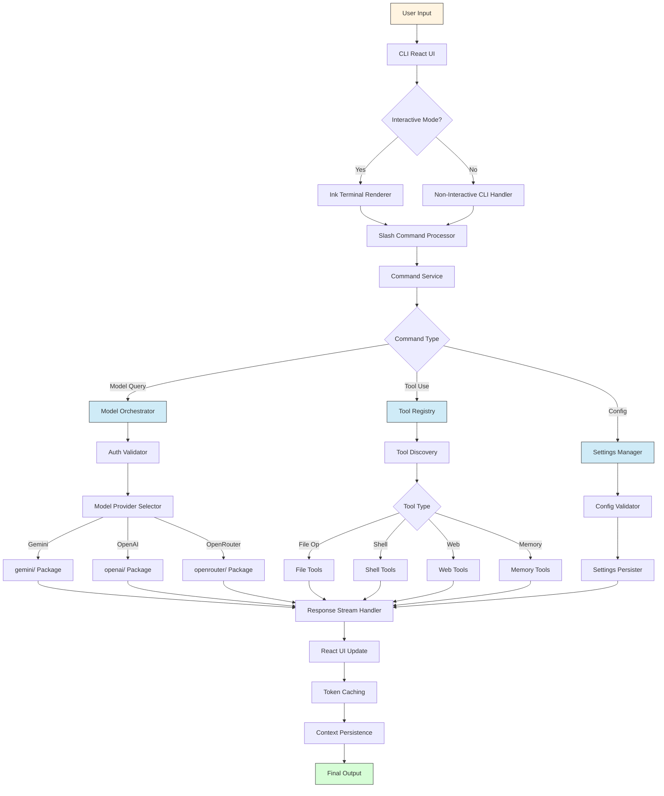

```mermaid
flowchart TD
    A[User Input] --> B[CLI React UI]
    B --> C{Interactive Mode?}
    C -->|Yes| D[Ink Terminal Renderer]
    C -->|No| E[Non-Interactive CLI Handler]
    
    D --> F[Slash Command Processor]
    E --> F
    
    F --> G[Command Service]
    G --> H{Command Type}
    
    H -->|Model Query| I[Model Orchestrator]
    H -->|Tool Use| J[Tool Registry]
    H -->|Config| K[Settings Manager]
    
    I --> L[Auth Validator]
    L --> M[Model Provider Selector]
    M -->|Gemini| N[gemini/ Package]
    M -->|OpenAI| O[openai/ Package]
    M -->|OpenRouter| P[openrouter/ Package]
    
    J --> Q[Tool Discovery]
    Q --> R{Tool Type}
    R -->|File Op| S[File Tools]
    R -->|Shell| T[Shell Tools]
    R -->|Web| U[Web Tools]
    R -->|Memory| V[Memory Tools]
    
    K --> W[Config Validator]
    W --> X[Settings Persister]
    
    N --> Y[Response Stream Handler]
    O --> Y
    P --> Y
    S --> Y
    T --> Y
    U --> Y
    V --> Y
    X --> Y
    
    Y --> Z[React UI Update]
    Z --> AA[Token Caching]
    AA --> AB[Context Persistence]
    AB --> AC[Final Output]
    
    style A fill:#FFE4B5,stroke:#333
    style AC fill:#98FB98,stroke:#333
    style J fill:#87CEEB,stroke:#333
    style I fill:#87CEEB,stroke:#333
    style K fill:#87CEEB,stroke:#333
    
    classDef component fill:#87CEEB,stroke:#333,fill-opacity:0.4;
    classDef terminal fill:#FFE4B5,stroke:#333,fill-opacity:0.4;
    classDef output fill:#98FB98,stroke:#333,fill-opacity:0.4;
    
    class I,J,K component
    class A terminal
    class AC output
    
    linkStyle 0 stroke:#333,fill:none;
    linkStyle 1 stroke:#333,fill:none;
    linkStyle 2 stroke:#333,fill:none;
```